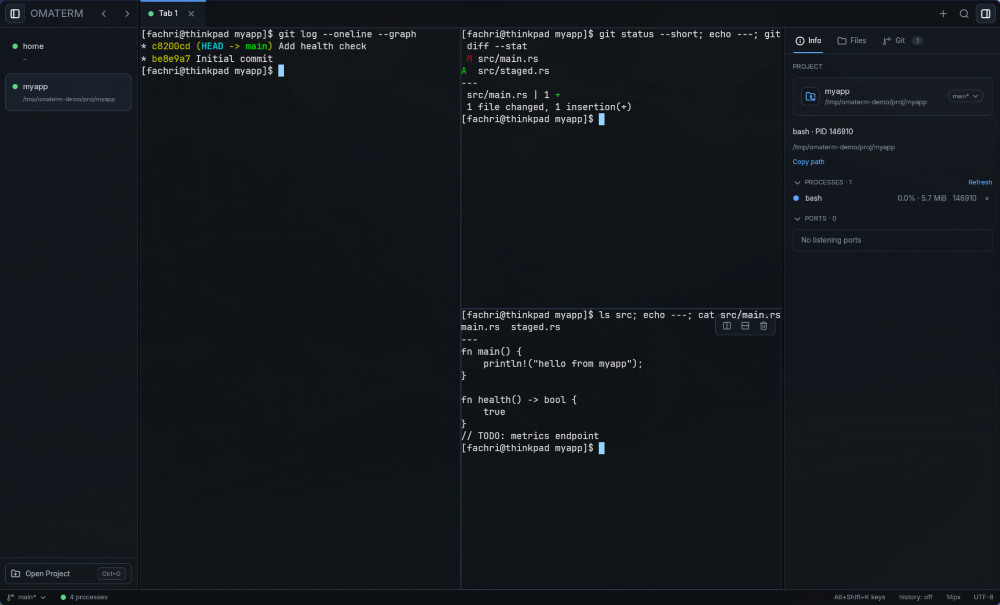
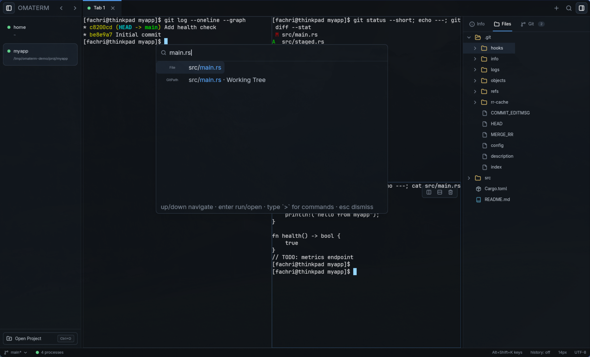
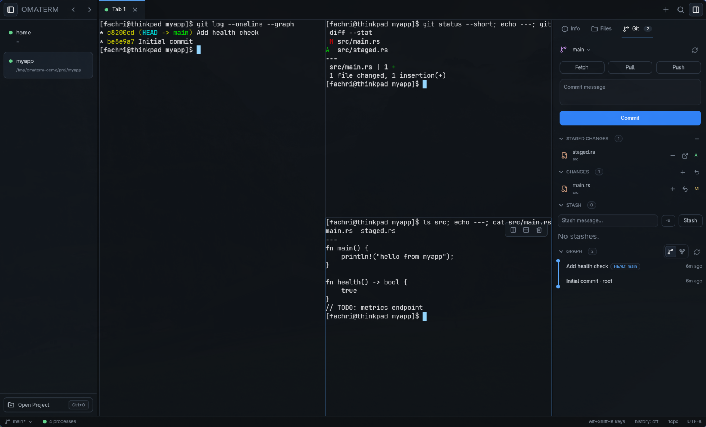
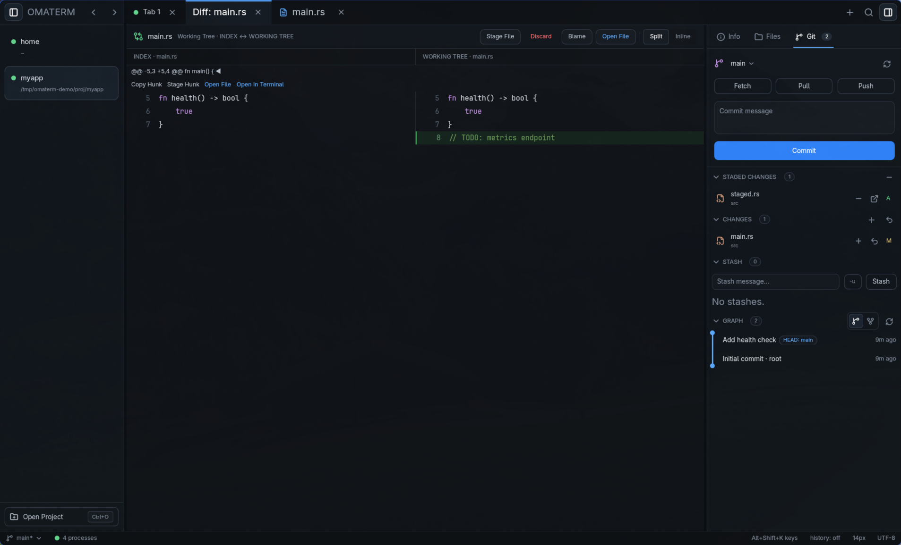
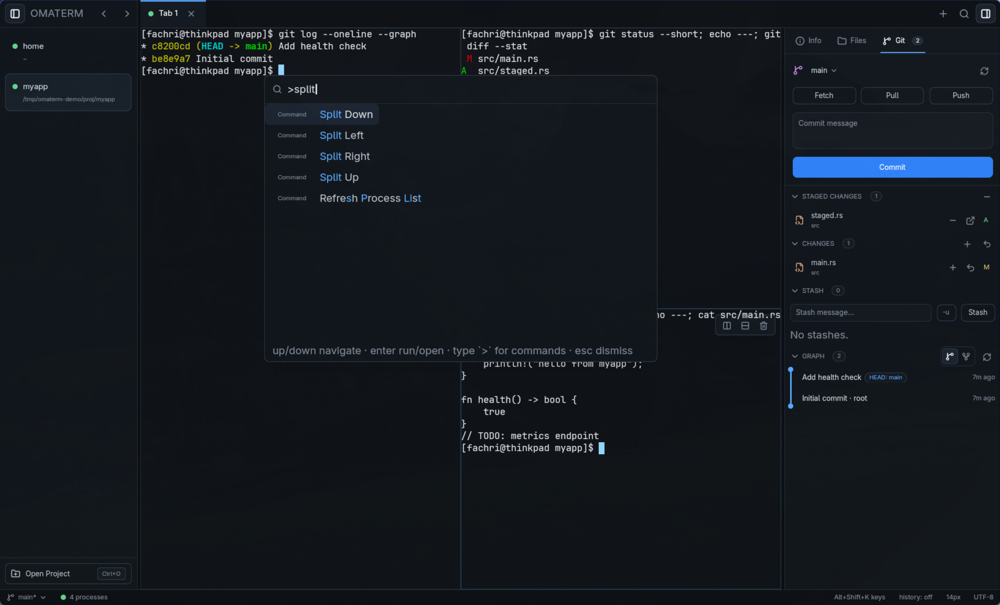
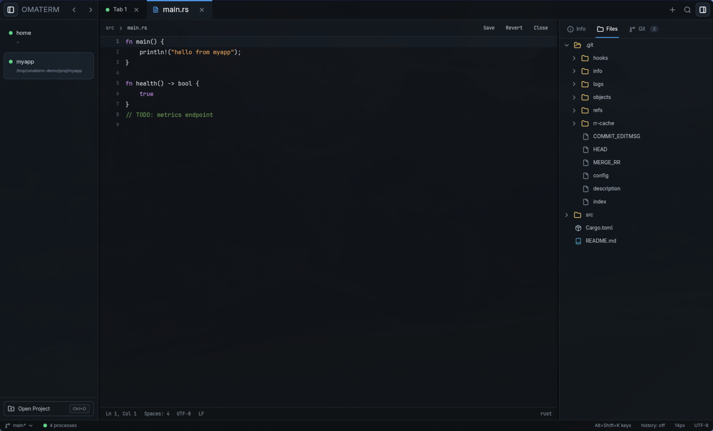

# OmaTerm

**A terminal-first developer workspace for Linux.** Real shells, recursive split
panes, and repo context in one fast native window — with every action also
available as a semantic CLI command, so your terminal setup today becomes your
agent-automation surface tomorrow.

Built with **Rust** and **GPUI**, powered by **`alacritty_terminal`**.
Inspired by [Kero](https://github.com/egoist/kero), made for
[Omarchy](https://omarchy.org) / Hyprland first.



> One window, one project, three live shells: commit graph, working-tree
> status, and source — side by side, all driven through the same command bus
> as the CLI.

## Why OmaTerm?

Most terminal setups force a choice: a tiling window manager with no project
awareness, or an IDE whose terminal is a second-class citizen. OmaTerm keeps
the **terminal as the center of gravity** and puts just enough workspace around
it — projects, tabs, splits, file tree, Git, diffs, a palette, a lightweight
editor — without turning into an IDE (no LSP, no debugger, no extensions, no
cloud accounts).

And unlike scripted window-manager automation, everything in OmaTerm goes
through **semantic commands** (`pane.split`, `terminal.run`, `git.stage`, …).
The UI, the `omaterm` CLI, and future AI agents all speak the same language
over a versioned Unix-socket IPC protocol — never simulated keystrokes.

```bash
omaterm pane list
omaterm pane split --right
omaterm terminal run --pane <id> -- cargo test
omaterm terminal read --pane <id> --lines 50
```

## Features

Open the command palette (`Ctrl+Shift+P`, `>` command mode) and run
`Preferences: Toggle Theme` — or pick an explicit `Preferences: Theme`
entry (`Dark`, `Light`, `Follow System`). The choice applies instantly to
the workspace and terminals and is saved to `~/.config/omaterm/config.toml`
(or `$XDG_CONFIG_HOME/omaterm/config.toml`):

```toml
[appearance]
theme = "light"
```

`dark` selects the dark palette; `system` follows the desktop appearance
live (Omarchy theme switches apply without a restart). The workspace and
terminal use the same selected palette.

### 🖥️ Terminal workspace done right

- **Real PTYs, real shells** — bash, zsh, fish, starship, TUIs (`vim`, `less`,
  …) all work. Your dotfiles keep working.
- **Recursive split panes** in all four directions, with resize, equalize,
  zoom (`Alt+Z`), and per-pane font zoom.
- **Long-lived sessions** — switching tabs or projects never restarts your
  shells; hidden panes keep processing output in the background.
- **Bounded scrollback**, terminal search (`Ctrl+Shift+F`), bracketed paste
  with risky-content confirmation, clipboard integration.

### 📁 Projects, tabs, files

- **Project sidebar** with multiple projects, per-project tabs, and session
  restore across restarts (layout and working directories come back; shells
  start fresh — honestly).
- **File tree** with icons, watcher-driven refresh, and expanded-directory
  memory.
- **Fuzzy file finder** (`Ctrl+P`) with skim-ranked results.



### 🌿 Git without leaving the terminal

- VS Code-style **status groups**: staged, unstaged, untracked — stage,
  unstage, discard (two-step confirm), and commit from the panel.
- **History graph** with per-commit file expansion, branch picker
  (create/rename/delete/checkout), stash push/pop/apply/drop, and
  Fetch/Pull/Push that never hang the UI.
- **Blame gutter** on demand.



### 🔍 Diff viewer

Split and Inline views with syntax highlighting, hunk navigation
(`Alt+N/P`), per-hunk stage (`Ctrl+Shift+S`), hunk copy, and one-click
**Open File** — for working-tree changes and historical commits alike.



### ⌨️ Command palette & shortcuts

Every semantic command is one fuzzy search away (`Ctrl+Shift+P`). A built-in
cheatsheet (`Alt+Shift+K`) documents all 35 shortcuts — `Alt+1..9` jumps tabs,
`Alt+Shift+1..9` jumps projects, and plain `Ctrl` bytes always belong to your
shell, never the chrome.



### ✏️ Built-in editor (lightweight, on purpose)

Open, edit, highlight (24 languages), save — with dirty-state tracking,
external-change detection, undo/redo, and multi-cursor-free simplicity. It is
deliberately **not** an IDE: no LSP, no autocomplete, no debugger.



### 🔭 Process awareness

The Info panel shows the focused shell's **child processes** (CPU/RSS) and
**listening ports** with scoped, pidfd-validated kill — per project, off the
UI thread.

### 🤖 CLI + IPC automation (the agent foundation)

- `omaterm` CLI covers projects, tabs, panes, terminals, files, git, diffs,
  processes, and history — human-readable by default, `--json` for machines,
  stable error codes and exit statuses.
- Versioned JSON protocol over an owner-validated Unix socket
  (`$XDG_RUNTIME_DIR/omaterm.sock`), project-scoped capabilities, no keyboard
  simulation, no guessing state from terminal text.
- Opt-in **encrypted history recovery**: ChaCha20Poly1305 archives in the OS
  keyring, plus an OmaTerm command journal — secrets never touch plaintext.

## Install

**Requirements:** Linux x86_64 with Wayland or X11 and working GPU drivers.
Omarchy/Hyprland is the first-class target. Windows is a second build target:
the desktop, terminal, and CLI compile there, while process listing stays empty
until a native query exists. On Windows, `Ctrl+Shift+P` switches new
terminals among PowerShell, Command Prompt, and Git Bash; the choice is
remembered. A Windows build needs the MSVC toolchain (Visual
Studio 2022 or Build Tools, workload **Desktop development with C++**), the
Windows SDK, and `fxc.exe` from that SDK on `PATH` — GPUI compiles its shaders
with it. Dependency versions and licenses are tracked in
[dependencies](docs/dependencies.md).

Prebuilt binary tarball from GitHub Releases, checksum-verified:

```bash
curl -sL https://github.com/fachrihawari/omaterm/releases/latest/download/install.sh | bash
```

User-only install (into `~/.local`, no sudo):

```bash
curl -fsSL https://github.com/fachrihawari/omaterm/releases/latest/download/install.sh | bash -s -- --user
```

Uninstall anytime (your data under `~/.config/omaterm` is left untouched):

```bash
curl -sL https://github.com/fachrihawari/omaterm/releases/latest/download/uninstall.sh | bash
```

On Arch/Omarchy, make sure the runtime libraries are present:

```bash
sudo pacman -S --needed gcc-libs fontconfig freetype2 libxkbcommon libx11 libxcb wayland vulkan-icd-loader
```

> **Note:** AUR packages (`omaterm` / `omaterm-bin`) are prepared in
> [`packaging/`](packaging/) but not published yet — AUR submissions are
> currently paused. The install script above is the supported method for now.

## Usage

Launch the desktop (or acknowledge the running instance):

```bash
omaterm
```

Open a directory as a project, optionally submitting a first command:

```bash
omaterm .
omaterm ~/Code/myapp
omaterm ~/Code/myapp -- cargo test
```

Control the workspace from any terminal — including from inside OmaTerm
itself, scoped to your project:

```bash
# Projects & tabs
omaterm project list
omaterm tab new --name tests

# Panes
omaterm pane list
omaterm pane split --right        # --left / --up / --down
omaterm pane focus <pane-id>
omaterm pane close <pane-id>

# Terminals
omaterm terminal run --pane <pane-id> -- cargo test
omaterm terminal read --pane <pane-id> --lines 50
omaterm terminal send --pane <pane-id> "ls -la"

# Files, Git, diffs, processes (full parity with the UI)
omaterm file search "main.rs"
omaterm git status
omaterm git stage src/main.rs && omaterm git commit -m "Add health check"
omaterm diff show
omaterm process list
```

Add `--json` to any command for machine-readable output. See
[`docs/09-milestone-9-cli.md`](docs/09-milestone-9-cli.md) for the full
command table and [`docs/shortcuts.md`](docs/shortcuts.md) for all 35
keyboard shortcuts.

## Architecture

```
                            OmaTerm (GPUI)
   ┌───────────────────────────────────────────────────┐
   │  Sidebar · Tabs · Recursive Pane Layout · Palette │
   │  Terminals · Files · Git · Diff · Editor · Info  │
   └───────────────────────┬───────────────────────────┘
                           │  semantic commands (OmaCommand)
   ┌───────────────────────▼───────────────────────────┐
   │  Rust Core: Workspace → Project → Tab → PaneTree  │
   │  Command Router · Terminal Registry · Persistence │
   └──────────┬────────────────────────────┬───────────┘
              │                            │
     Terminal subsystem               IPC Server
              │                      Unix socket
     TerminalEngine (alacritty)  ┌────┴─────┐
              │                  │          │
             PTY            omaterm CLI  AI agent (future)
              │
         bash/zsh/fish
```

**Crates:** `omaterm-core` (pure domain logic, no GUI dependency) ·
`omaterm-terminal` (PTY + engine abstraction) · `omaterm-state` (versioned
snapshots, encrypted history) · `omaterm-protocol` + `omaterm-ipc` (versioned
JSON over Unix socket) · `omaterm-context` (files + git over the system
binary) · `omaterm-cli` · `apps/omaterm` (`omaterm-desktop` GUI).

Key design rules: terminal process lifetime ≠ view lifetime; recursive
`PaneNode` tree (never a flat grid); persist layout, not processes; project
scoping is a security boundary; automation uses commands, never keystrokes.

## Project status & roadmap

OmaTerm is pre-1.0 and under active development (current: `v0.2.0`).

| Version | Focus | State |
|---|---|---|
| **0.1** | Terminal workspace (projects, tabs, splits, PTY, persistence, router, IPC, CLI) | ✅ Done |
| **0.2** | Developer context (file tree, git, diff, palette, editor, processes) | ✅ Done |
| **0.3** | Agent awareness (process recognition, status, notifications) | Planned |
| **0.4** | Agent automation (spawn, prompt, wait, delegated panes) | Planned |

Track live progress in [`docs/status.md`](docs/status.md), release gates in
[`docs/acceptance-matrix.md`](docs/acceptance-matrix.md), and the full
79-section product/architecture spec in
[`OMATERM_AGENT_BLUEPRINT.md`](OMATERM_AGENT_BLUEPRINT.md).
[`AGENTS.md`](AGENTS.md) is the entry point for AI-assisted development.

## Contributing

You need Rust (see `rust-toolchain.toml`, currently 1.98.1) plus the native
GUI dependencies. On Arch:

```bash
sudo pacman -S --needed wayland libxkbcommon libx11 libxcb fontconfig freetype2 mesa vulkan-icd-loader pkgconf
```

On Ubuntu/Debian:

```bash
sudo apt install libfontconfig1-dev libfreetype-dev libvulkan1 libwayland-dev libx11-dev libxcb1-dev libxkbcommon-dev pkg-config
```

On Windows, install Visual Studio 2022 or the Build Tools with the **Desktop
development with C++** workload, including the Windows SDK. GPUI's shader build
calls `fxc.exe`. The kit copies it to
`Windows Kits\10\bin\<sdk-version>\x64\fxc.exe`; that directory has to be on
`PATH` before `cargo build --bin omaterm-desktop`. `link.exe` must be the MSVC
linker, not the one Git for Windows puts on `PATH`.

Then:

```bash
git clone https://github.com/fachrihawari/omaterm
cd omaterm
cargo build --release --bin omaterm --bin omaterm-desktop
./target/release/omaterm-desktop
```

Before submitting changes, run:

```bash
cargo fmt --all --check
cargo test --workspace
cargo clippy --workspace --all-targets -- -D warnings
```

UI changes need real Wayland validation on top of the automated gates.
Milestone specs live in [`docs/`](docs/00-overview.md); implement in vertical
slices, record evidence in `docs/status.md`, and never report an unavailable
check as passing.

## License

MIT OR Apache-2.0 — see `LICENSE-MIT` and `LICENSE-APACHE`. Kero and Zed are
behavioral/architectural references only; no GPL implementation code is
incorporated.
